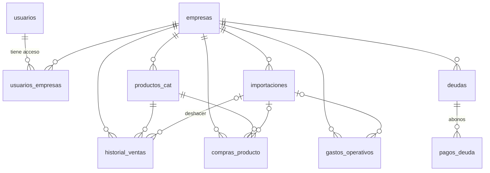

# Esquema de la base de datos

Fuente única: `backend/app/db/models.py`. El script `backend/scripts/generar_seed.py` genera `database/schema.sql` y `database/cuentas_claras.sql` para MySQL 8.

Montos en `DECIMAL(12,2)` (MXN). Toda tabla de negocio lleva `id_empresa`.

| Tabla | Para qué | Columnas clave |
|---|---|---|
| `usuarios` | Personas que inician sesión | `id_usuario`, `nombre`, `email` (único), `password_hash` |
| `empresas` | Tiendas | `nombre_negocio`, `giro`, `ciudad`, `regimen_fiscal` (fase 2), `saldo_inicial`, `fecha_saldo_inicial`, `umbrales_alerta` (JSON) |
| `usuarios_empresas` | Permisos | `id_usuario`, `id_empresa`, `rol` (`dueno` \| `consulta`) |
| `productos_cat` | Registro de productos | `sku_o_nombre` (único por empresa), `categoria`, `unidad`, `stock_actual`, `stock_minimo`, `costo_promedio`, `precio_venta` |
| `historial_ventas` | Registro de ventas | `id_producto`, `fecha_hora`, `cantidad_vendida`, `precio_unitario`, `costo_unitario` |
| `deudas` | Deudas del negocio (tarjetas, créditos, proveedores, préstamos) | `acreedor`, `tipo`, `saldo_actual`, `tasa_interes_anual`, `plazo_meses`, `pago_mensual`, `limite_credito`, `dia_limite_pago`, `estado` |
| `pagos_deuda` | Abonos a una deuda | `id_deuda`, `fecha`, `monto`, `capital`, `interes`, `iva` |
| `compras_producto` | Registro de compras de producto | `id_producto`, `fecha`, `cantidad`, `costo_unitario`, `proveedor` |
| `gastos_operativos` | Registro de gastos operativos | `fecha`, `concepto`, `categoria`, `tipo` (`fijo` \| `variable`), `monto` |
| `importaciones` | Historial de cargas | `nombre_archivo`, `tipo_datos`, `estado`, `filas_ok`, `filas_con_error`, `detalle_errores` (JSON) |

**Índices:** `(id_empresa, fecha_hora)` en ventas · `(id_empresa, fecha)` en compras y gastos · `(id_empresa, id_producto)` en productos · `(id_empresa, fecha)` en importaciones.

**Vista `v_ventas_diarias`** (`id_empresa`, `id_producto`, `fecha`, `unidades`, `ingreso`, `costo`): serie diaria por producto, lista para modelos de series de tiempo (fase 2).

## Cómo se calculan los KPIs

| KPI | Fórmula | Origen |
|---|---|---|
| Ventas | Σ cantidad × precio_unitario | `historial_ventas` |
| Costo de ventas | Σ cantidad × costo_unitario | `historial_ventas` |
| Gastos de operación | Σ monto con `tipo` en (`fijo`, `variable`) | `gastos_operativos` |
| Utilidad | ventas − costo de ventas − gastos de operación − impuestos (0 en fase 1) | |
| Punto de equilibrio mensual | gastos fijos al mes ÷ ((ventas − costo de ventas − gastos variables) ÷ ventas) | |
| Efectivo | saldo inicial + ventas − compras − gastos | ventas, compras, gastos |
| Días de inventario | stock actual ÷ venta diaria promedio (últimos 30 días) | |
